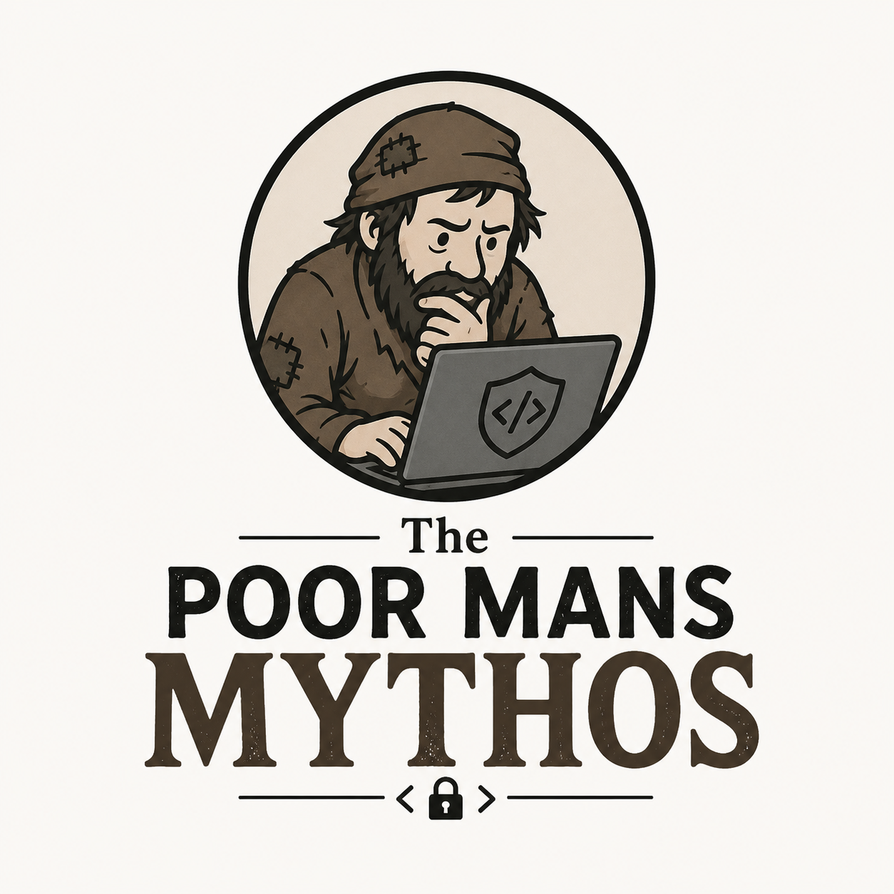

<p align="center">
  
</p>

# Poor Man's Mythos

[Claude Mythos](https://red.anthropic.com/2026/mythos-preview/) is Anthropic's restricted AI model built specifically for finding and exploiting security vulnerabilities. It's genuinely impressive — it has discovered zero-days in every major OS and browser, and compressed years of security auditing into weeks. Anthropic decided it was too dangerous for public access, so it's gated behind [Project Glasswing](https://www.anthropic.com/glasswing), an invite-only industry consortium for organizations maintaining critical software.

We are not one of those organizations.

So here's this instead: a Claude Code plugin that uses regular Claude to do a best-effort security audit of your repo. It won't find 27-year-old kernel bugs. But it will systematically read your code, rank files by risk, spawn parallel review agents looking for OWASP Top 10 issues and logic errors, and validate each finding before writing a report. For most projects, that's probably enough.

## Installation

```
/plugin marketplace add hanskhe/poor-mans-mythos
/plugin install poor-mans-mythos@poor-mans-mythos
```

## Usage

```
Run a security audit on this repo
```

Claude will rank all files by risk, ask how many to investigate, then run parallel review and validation agents before producing a final report in `.security-audit/`.

## How it works

1. **Rank** — Reads every file, rates it 0–5 by security risk, asks how many to investigate
2. **Review** — Spawns one agent per file to hunt for vulnerabilities (OWASP Top 10, OWASP API Security Top 10, and logic errors)
3. **Validate** — Spawns one agent per finding to confirm or dismiss it, then writes the final report

## License

MIT
